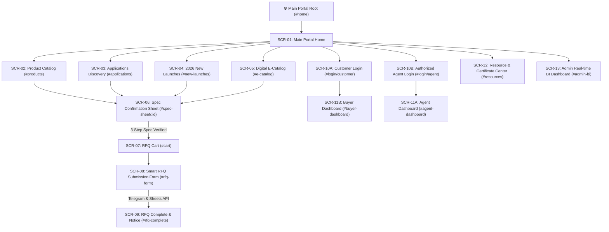

# DAIHAN Scientific Global B2B Sales & Smart RFQ Portal
## Unified UI Specification & Design System Guide (`UI_spec.md`)

---

## 📌 Document Overview
본 문서는 **DAIHAN Scientific Global B2B Product Exploration & Zero Specification Error Smart RFQ Portal**의 전체 웹 애플리케이션 사이트맵, 화면별 UI 상세 명세 및 **Option A (Deep Midnight Cyan Glassmorphism)** 디자인 가이드를 통합 정리한 명세서입니다.  
StitchMCP 및 프로토타이핑 툴에서의 프리뷰(Preview), 컴포넌트 생성 및 테스팅에 직접 활용할 수 있도록 정밀하게 표준화되었습니다.

---

## 🗺️ 1. Site Map (전체 사이트맵)



---

## 📱 2. Screen UI Specifications (화면별 UI 명세)

### 🔹 Global Shared Components (공통 구성 요소)
* **Site Header (`.site-header`)**:
  * **Logo Area**: "DH" 로고 아이콘 (딥 블렌딩 시안 그라디언트 + 글로우) 및 대한과학 브랜드 텍스트.
  * **Navigation Links**: Home, Categories, Applications, 2026 Launches, E-Catalog, BI Dashboard (데스크톱 1줄 정렬 / 모바일 `<768px` 환경 3×2 그리드 2줄 자동 전환: 1행-Home/Categories/Applications, 2행-2026 Launches/E-Catalog/BI Dashboard).
  * **Header Actions**:
    * `Agent Login / Dashboard`: 대리점 전용 할인율 상태 및 대시보드 바로가기.
    * `Customer Sign In`: 신규 바이어 계정 생성/로그인.
    * `Cart Quick Badge`: 담긴 장바구니 품목 수 실시간 배지 표시.
* **Site Footer (`.site-footer`)**:
  * 본사 글로벌 오버시즈 디비전 정보, 공식 웹사이트 링크 (`www.daihan-sci.com`).
  * 시스템 아키텍처 아웃라인 (Zero Spec Error Gateway, Multi-Channel Telegram Pipeline, $0 Serverless Edge).

---

### [SCR-01] Main Portal Home (`#home`)
* **목적**: 바이어의 첫 방문 지점이자 3가지 직관적 탐색 경로(Multi-Path Discovery) 제공.
* **주요 UI 요소**:
  * **Ambient Hero Banner (`.hero-banner`)**: 
    * 메인 헤드라인: **Smart RFQ Generator**
    * 서브 카피: **Fast, Accurate Quotes for Every Lab Need**
    * 우측 대한과학 CI 브랜드 카드 (`.hero-ci-card`): 대한과학 공식 로고 이미지 (`images/daihan-ci.png`) 배치, 글래스모피즘 인터랙션 및 명시적 레이어 계층(`z-index: 5`) 적용.
    * 실시간 자동완성 검색창 (`#hero-search-input`): 모델명(STE-AM47, MS-20D 등), Cat No., 키워드 실시간 매칭 최상위 드롭다운 (`#hero-search-results`, `z-index: 9999`).
  * **3-Path Discovery Grid (`.discovery-grid`)**:
    1. **Path 1: Standard Equipment Catalog** (`#products` - 카테고리별 표준 장비).
    2. **Path 2: Research Application Sets** (`#applications` - 바이오/화학/의학 패키지).
    3. **Path 3: 2026 New Launches & PDF Catalog** (`#e-catalog` - 신제품 및 356P 공식 카달로그 인덱스).
  * **Featured 2026 Highlight Grid**: 주요 대표 상품 4종의 고해상도 이미지 및 카드 배치.

---

### [SCR-02] Product Catalog by Category (`#products`)
* **목적**: 356페이지 마스터 카달로그에 등재된 실증 장비 20여 종 이상을 카테고리별로 빠르게 필터링 탐색.
* **주요 UI 요소**:
  * **Category Filter Bar**: All Equipment, Autoclaves(p.300), Magnetic Stirrers(p.310), Ovens(p.218), Incubators(p.190), Water Baths(p.48), Centrifuges(p.92), Balances(p.16), ULT Freezers(p.98).
  * **Product Card Grid (`.product-grid`)**:
    * 고해상도 제품 커버 이미지 + NEW 배지.
    * 카테고리 태그, 모델명(Model No), Cat No.
    * 스펙 요약 프리뷰 박스 (온도 범위, 용량, Stirring Speed 등).
    * 에이전트 로그인 시 Ex-Works 우대 가격 및 바이어 표시용 목록.
    * `View Final Spec` 버튼 -> **SCR-06**으로 연결.

---

### [SCR-03] Research Application Discovery (`#applications`)
* **목적**: 연구 목적별(Bio, Chemical, Medical) 최적화된 장비 조합을 패키지 형태로 추천 탐색.
* **주요 UI 요소**:
  * 바이오/생명공학 패키지 (Autoclave + Incubator + Centrifuge).
  * 화학/합성 패키지 (Hotplate Stirrer + Water Bath + Oven).
  * 임상/의학 패키지 (ULT Freezer + Balance + Stirrer).

---

### [SCR-04] 2026 New Launches Showcase (`#new-launches`)
* **목적**: 2026년 신규 출시된 DAIHAN의 차세대 스마트 조작기 및 프리미엄 라인업 단독 소개.

---

### [SCR-05] Digital E-Catalog Viewer (`#e-catalog`)
* **목적**: 356페이지 분량의 공식 2026 DAIHAN Master Catalog PDF 색인과 핫스팟 링크 매핑.

---

### [SCR-06] Final Spec Confirmation Sheet - Gatekeeper (`#spec-sheet/:id`) ⭐ (Core Screen)
* **목적**: 사양 오류(전압 불일치, 플러그 미선택) 0% 달성을 위한 Gatekeeper 최종 검증 화면.
* **주요 UI 요소**:
  * **Spec Header Grid**: 제품 메인 이미지(380px 고해상도) + 모델명 + 제조 리드타임 배지(e.g., 2-3 Weeks Ex-Works).
  * **3-Step Specification Error Prevention Gateway**:
    * **Step 1. Fixed Specifications & Voltage Check**: 전압/주파수(230V 50/60Hz, 120V 등) 및 필수 확인 사항 체크박스 (`.ack-checkbox-wrap`).
    * **Step 2. Plug Type & Option Selection**: 사용 국가별 플러그 규구 Card 선택 (EU Type C/F, US Type A/B, UK Type G 등).
    * **Step 3. Required Accessories Selection**: 전용 스탠드, 바스켓, 테프론 바 등 액세서리 수량 선택.
  * **Action Bar (`.spec-action-bar`)**:
    * 게이트키퍼 검증 미완료 시 경고 메시지 및 버튼 비활성화.
    * 3단계 필수 체크 완료 시 `Add to RFQ Cart` 버튼 발광 활성화.

---

### [SCR-07] RFQ Cart Screen (`#cart`)
* **목적**: 검증이 완료된 견적 요청 대상 품목들의 수량 변경, 총 리스트 및 주문 진행 처리.

---

### [SCR-08] Smart RFQ Submission Form & Routing Notice (`#rfq-form`)
* **목적**: 바이어 기본 정보 입력 및 자동 지역/담당자 라우팅 처리.
* **주요 UI 요소**:
  * **Routing Notice Banner**: 입력된 국가/지역에 따라 전담 오버시즈 담당자에게 자동 라우팅됨을 안내.
  * **Form Grid**: Company Name, Contact Name, Email, Country, Phone/WhatsApp, Target Lead Time, Special Notes.
  * **Submit Button**: 제출 즉시 Telegram Bot API & Google Sheets API 멀티 채널 동시 전송.

---

### [SCR-09] RFQ Complete & Agent Notice Screen (`#rfq-complete`)
* **목적**: RFQ 접수 완료 확인 및 고유 RFQ 픽스처 ID(e.g., `RFQ-2026-X89A`) 및 텔레그램 알림 완료 통지.

---

### [SCR-10] Login Portals (`#login/customer`, `#login/agent`)
* **SCR-10A (Customer Sign In)**: 신규 바이어 및 일반 사용자 계정 접속.
* **SCR-10B (Authorized Agent Login)**: 정식 대리점 전용 인증 코드 로그인 (우대 마진율 연동).

---

### [SCR-11] Agent & Buyer Dashboards (`#agent-dashboard`, `#buyer-dashboard`)
* **Agent Dashboard**: 대리점 등급별 Ex-Works 할인율 표시 및 대리점 전용 RFQ 내역 관리.
* **Buyer Dashboard**: 과거 발송한 견적 요청서 이력 및 수신된 오피셜 Quote 피드백 상태 확인.

---

### [SCR-12] Resource & Certificate Center (`#resources`)
* **목적**: CE, ISO9001/13485 인증서, 영문 매뉴얼, MSDS 다운로드 센터.

---

### [SCR-13] Sales Admin Real-time BI Dashboard (`#admin-bi`)
* **목적**: 전 세계 대륙별 견적 유입 현황, 인기 카테고리 실시간 BI 통계 차트.

---

## 🎨 3. Design Guidelines (Proposal 1: Premium Light Platinum & Glassmorphism)

StitchMCP 및 웹 프로토타입 작성 시 준수해야 하는 **제안 1 (Apple Modern Light Platinum & Glass)**의 핵심 디자인 토큰입니다.

### 🎨 Color Palette & CSS Variables

```css
:root {
  /* Brand Primary & Accents */
  --primary: #0284c7;           /* Marine Cyan / Ocean Blue (Main Highlight) */
  --primary-hover: #0369a1;
  --primary-light: #e0f2fe;
  --primary-glow: rgba(2, 132, 199, 0.25);
  
  --secondary: #0f172a;         /* Deep Slate Navy (Header & Accent Text) */
  --secondary-hover: #1e293b;
  --secondary-light: #f1f5f9;
  
  --accent: #ef4444;            /* Coral Red (New Badge & Alerts) */
  --accent-light: #fef2f2;
  
  --success: #10b981;           /* Emerald Green */
  --success-light: #ecfdf5;
  
  --agent-purple: #8b5cf6;       /* Royal Purple (Agent Badge) */
  --agent-light: #f3e8ff;

  /* Background Palette (Clean Light Glass) */
  --bg-main: #f8fafc;           /* Crisp Matte Light Platinum Gray */
  --bg-card: #ffffff;           /* Pure White Glass Panel */
  --bg-card-solid: #ffffff;
  --bg-card-hover: #ffffff;

  /* Text System */
  --text-main: #0f172a;         /* Deep Slate Navy / Black */
  --text-muted: #475569;        /* Cool Slate Gray */
  --text-dim: #64748b;          /* Soft Slate Gray */

  /* Borders & Shadows (Crisp & Clear Block Boundaries) */
  --border-color: #e2e8f0;
  --glass-border: 1px solid #e2e8f0;
  --border-hover: #0284c7;

  --shadow-sm: 0 2px 6px rgba(15, 23, 42, 0.04);
  --shadow-md: 0 10px 25px rgba(15, 23, 42, 0.07), 0 2px 6px rgba(15, 23, 42, 0.04);
  --shadow-lg: 0 20px 40px rgba(15, 23, 42, 0.12), 0 4px 12px rgba(15, 23, 42, 0.05);
}
```

---

### 🔤 Typography System

* **Primary Font Family**: `'Plus Jakarta Sans'`, `'Inter'`, `-apple-system`, `BlinkMacSystemFont`, `sans-serif`
* **Letter Spacing**: `-0.02em` ~ `-0.04em` (타이트하고 세련된 자간)
* **Font Weights**:
  * **Headings (H1~H4)**: `800` (ExtraBold)
  * **Subtitles & Badges**: `700` (Bold)
  * **Navigation & Buttons**: `600` ~ `700` (SemiBold / Bold)
  * **Body Text**: `400` ~ `500` (Regular / Medium)

---

### ✨ Glassmorphism & Micro-Interactions

1. **Frosted Glass Cards (`.path-card`, `.product-card`, `.spec-sheet-container`)**:
   ```css
   background: rgba(17, 24, 39, 0.72);
   backdrop-filter: blur(16px);
   -webkit-backdrop-filter: blur(16px);
   border: 1px solid rgba(255, 255, 255, 0.12);
   border-radius: 16px;
   ```
2. **Squircle Border Radius**:
   * Small (`--radius-sm`): `10px`
   * Medium (`--radius-md`): `16px`
   * Large (`--radius-lg`): `24px`
3. **Hover Elevation & Ambient Shift**:
   ```css
   .path-card:hover, .product-card:hover {
     transform: translateY(-6px);
     box-shadow: 0 20px 45px rgba(0, 0, 0, 0.7), 0 0 30px rgba(0, 245, 212, 0.15);
     border-color: rgba(0, 245, 212, 0.4);
   }
   ```

---

### 📐 Spacing & Layout Grid (여백 기준)

| 구분 | 값 (px / rem) | 용도 |
| :--- | :--- | :--- |
| **Container Max-Width** | `1360px` | 전체 메인 레이아웃 및 헤더/푸터 최대 너비 |
| **Grid Gaps** | `1.75rem (28px)` | 카드 그리드 간격 (`.discovery-grid`, `.product-grid`) |
| **Card Internal Padding** | `2rem (32px)` | 대형 카드 내부 여백 (`.path-card`, `.spec-sheet-container`) |
| **Section Margin** | `3rem ~ 3.5rem` | 주요 섹션 간 상하 분리 여백 |

---

### 📱 Responsive Breakpoints & Rules (반응형 기준)

| Breakpoint | Target Devices | Layout Adjustments |
| :--- | :--- | :--- |
| **`> 1280px`** | Desktop / Large Monitor | 3-Column Discovery Grid, 4-Column Product Grid |
| **`1025px ~ 1279px`** | Laptop / Desktop | 2-Column Discovery Grid, 3-Column Product Grid |
| **`< 1024px`** | Mobile / Tablet / In-App Browsers | 1-Column Stacked Grid, Header Nav 3×2 Grid (3열 2행 탭), Viewport Auto-Scaling Prevention (`maximum-scale=1.0`), Hero Search Box `min-width: 0`, Action Bar Column Flex |

---

## 🚀 4. StitchMCP Prototype Testing & Preview Guide

StitchMCP를 사용하여 본 명세서 기반의 프로토타입을 생성하거나 스크린을 테스트할 때 활용할 수 있는 권장 스텝입니다.

1. **Design System Creation (`create_design_system_from_design_md`)**:
   * 본 `UI_spec.md` 파일의 Section 3 디자인 가이드를 기반으로 Stitch 프로젝트 내 디자인 시스템을 등록합니다.
2. **Screen Generation (`generate_screen_from_text`)**:
   * Section 2의 화면별 UI 명세 (`SCR-01`, `SCR-06`, `SCR-08` 등) 텍스트 명세를 프롬프트로 전달하여 각 개별 화면의 UI 렌더링 프로토타입을 생성합니다.
3. **Interactive Flow Preview (`edit_screens` / `generate_variants`)**:
   * `SCR-01` -> `SCR-06` (Gatekeeper 3-Step) -> `SCR-08` (RFQ Form)으로 이어지는 핵심 사용자 전환 여정을 프로토타입 뷰어로 검증합니다.
